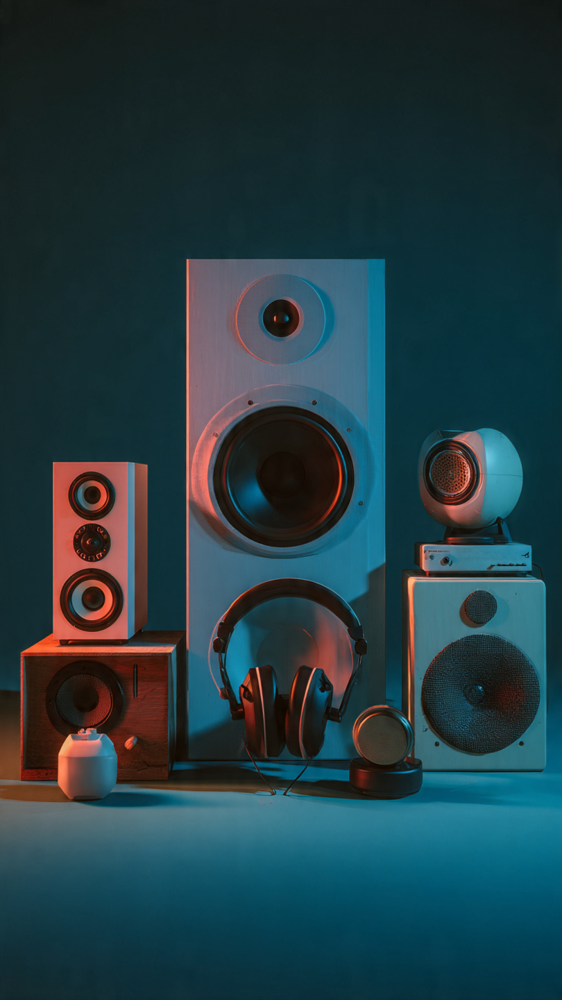
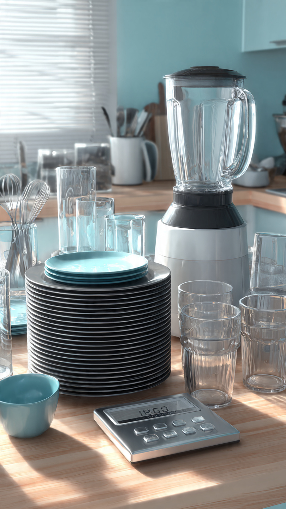
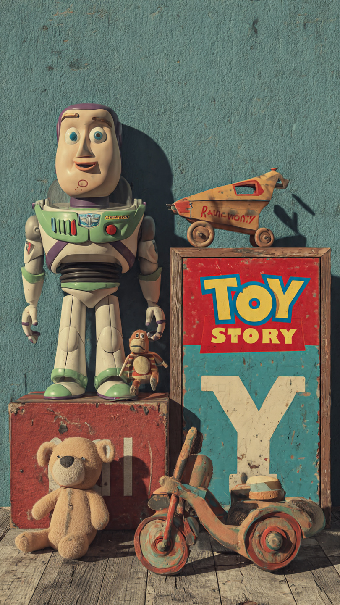
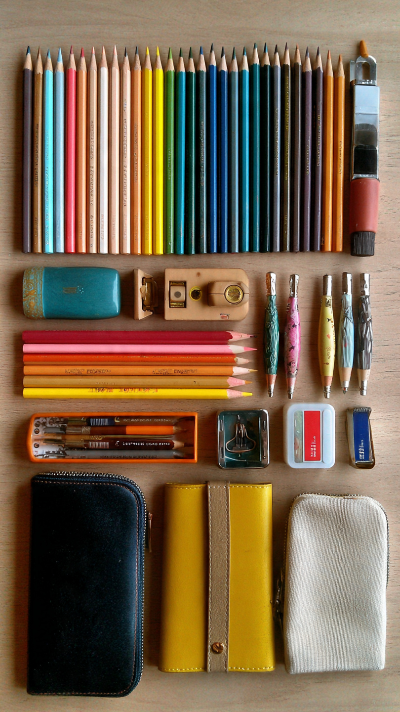

<!DOCTYPE html>
<html lang="sp">
<head>
    <meta charset="UTF-8">
    <meta name="viewport" content="width=device-width, initial-scale=1.0">
    <title>Document</title>
</head>
<body>
    <header>
        <h1 id="titulo">Los Rivadeneira</h1>
        <h2>Una empresa familiar</h2>
        
        

    </header>
    <section>
        <h2>Categoría de productos</h2>
        

        <article class="categoria">
            
            <h2>Audio e imágen</h2>
        </article>
        <article class="categoria">
            
            <h2>Bazar y electrodomésticos</h2>
        </article>
        <article class="categoria">
            
            <h2>Juguetes</h2>
        </article>
        <article class="categoria">
            
            <h2>Librería</h2>
        </article>
        <article class="categoria">
            
            <h2>Accesorios</h2>
        </article>
    </section>
    <footer>
        <a href="#titulo"> Ir al comienzo</a>
        <a href="https://www.google.com"> Ir a google</a>
        <a href="https://wa.me/qr/OHBHYIRRG6QSJ1"> WhatsApp</a>
    </footer>
</body>
</html>
